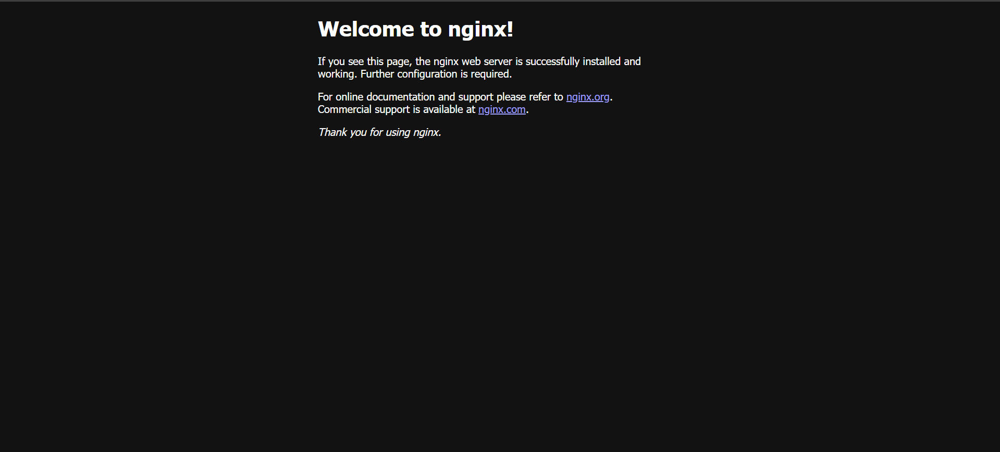

🌐 Prerequisites
Make sure the following are installed and configured:
 1. Install Terraform
 Download and install Terraform from: 
👉 [https://developer.hashicorp.com/terraform/downloads]
Verify installation:
terraform -version

2. Install Docker
Download Docker Desktop from:
👉 https://docs.docker.com/get-docker/

Verify Docker is working:
docker --version
docker ps
🔧 Tools & Versions

| Tool       | Version (Recommended)      |
|------------|----------------------------|
| Terraform  | v1.6.0 or later            |
| Docker     | v20.10 or later            |
| OS         | Windows / macOS / Linux    |

🧠 How It Works (IaC Flow)
Terraform uses the Docker provider.
Pulls the nginx:latest image.
Provisions a container bound to a local port.
Exposes the nginx server at http://localhost:<port>.

🛠️ Step-by-Step Implementation

1. Create a New Project Directory or 
mkdir terraform-docker or git clone https://github.com/<your-username>/terraform-docker.git
cd terraform-docker

2. Create main.tf
What this does:
Downloads the nginx image.
Creates a container named my-nginx.
Exposes the container on port 8081.

3. Initialize Terraform
terraform init      This installs the required Docker provider

4. Plan Terraform Changes
terraform plan     This shows what Terraform will create. Always check before applying

 5. Apply Configuration
terraform apply    Type yes to confirm.
Now, the nginx container will run locally. You can verify:
docker ps

Go to http://localhost:8081 in your browser to see the nginx welcome page.

6. Inspect Terraform State
terraform state list
terraform show           Verifies what's been created and managed.

7. Destroy the Infrastructure
terraform destroy       Again, type yes to confirm.

This cleans up everything (image and container).

Command to save logs: tee logs/terraform_init.txt
example : terraform init | tee logs/terraform_init.txt

📸 Screeenshots

